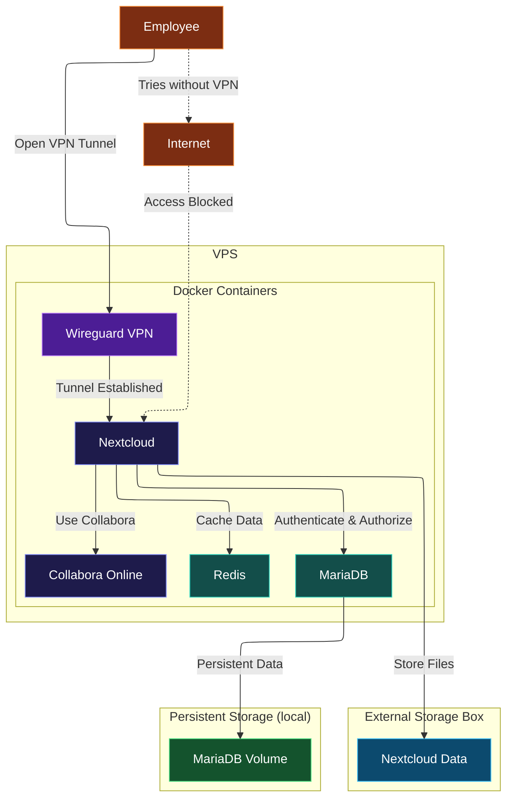

# AGRUPA-cloud
## General Overview

A private, docker-based collaboration platform for a small company. The platform is intended to keep internal services protected from direct public access by requiring users to connect through a VPN.

## Features

- Private file storage
- Secure remote access
- Online document editing
- Private DNS
- Persistent database
- Caching and file locking

## Technologies

* Docker
* Nextcloud
* MariaDB
* Redis
* Wireguard
* CoreDNS
* Collabora ONLINE

## Architecture

## Requirements

- Linux server
- Docker
- Docker Compose

## 
