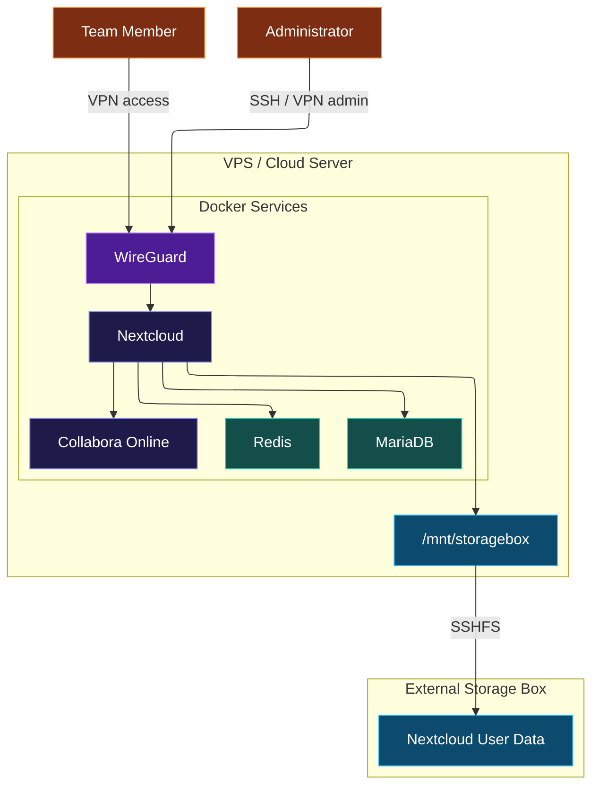

# AGRUPA Cloud

AGRUPA Cloud is a private, Docker-based collaboration platform designed for a small company or internal team. It provides private file storage, shared team folders, browser-based document editing, database persistence, caching, and VPN-based access.

The project aims to provide some of the core features of platforms like Google Drive using self-hosted and open-source technologies.

## Features

* Private file storage with Nextcloud
* Secure remote access through WireGuard VPN
* Shared team folders
* Browser-based document editing with Collabora Online
* Persistent MariaDB database
* Redis caching and file locking
* External user data storage through a Hetzner Storage Box
* Docker Compose orchestration

## Technologies

* Docker
* Docker Compose
* Nextcloud
* MariaDB
* Redis
* WireGuard
* Collabora Online / CODE
* SSHFS
* Hetzner Storage Box

## Architecture



## Services

| Service          | Purpose                         | Access              |
| ---------------- | ------------------------------- | ------------------- |
| WireGuard        | Private remote access           | Public UDP port     |
| Nextcloud        | File storage, sharing and users | VPN/internal access |
| MariaDB          | Nextcloud database              | Docker network only |
| Redis            | Cache and file locking          | Docker network only |
| Collabora Online | Browser-based Office editing    | VPN/internal access |
| Storage Box      | External user data storage      | Mounted with SSHFS  |

## Project Structure

```txt
/opt/agrupa-cloud
├── docker-compose.yml
├── .env.example
├── secrets/
├── backups/
└── docs/
```

Main persistent paths:

```txt
MariaDB data:        /mnt/HC_Volume_*/mariadb
Nextcloud data:     /mnt/storagebox/nextcloud-data
Storage mountpoint: /mnt/storagebox
```

## Basic Usage

Start the stack:

```bash
cd /opt/agrupa-cloud
docker compose up -d
```

Check services:

```bash
docker compose ps
```

Check Nextcloud status:

```bash
docker exec -u www-data -it nextcloud php occ status
```

Before starting Nextcloud, the external Storage Box must be mounted correctly:

```bash
findmnt /mnt/storagebox
df -h /mnt/storagebox
```

If the mount points to the local server disk instead of the Storage Box, Nextcloud should not be started.

## Documentation

More detailed documentation is available in the `docs/` directory:

```txt
docs/
├── architecture.md
├── deployment.md
├── operations.md
├── storage.md
├── networking.md
├── backup-restore.md
├── disaster-recovery.md
├── admin-guide.md
├── user-guide.md
├── security.md
├── troubleshooting.md
├── known-issues.md
├── future-improvements.md
└── changelog.md
```

## Security Notes

This project follows a VPN-first access model. Internal services such as MariaDB and Redis should not be exposed directly to the public internet.

Sensitive values such as real IP addresses, Storage Box credentials, database passwords, WireGuard private keys, `.env` files, Docker secrets and the real Nextcloud `config.php` should not be committed to a public repository.

Use placeholders in public documentation:

```txt
<SERVER_PUBLIC_IP>
<PRIVATE_SERVER_IP>
<STORAGEBOX_USER>
<STORAGEBOX_HOST>
<USERNAME>
```

## Current Status

The platform is functional and has been validated with:

```txt
Nextcloud installed: true
Nextcloud version: 31.0.14
Maintenance mode: false
Database upgrade needed: false
```

The main remaining improvement is making the Storage Box mount persistent and ensuring Docker starts only after the external storage is available.

## Limitations

* Requires external infrastructure and basic system administration
* Depends on WireGuard availability for private access
* Depends on the Storage Box mount for Nextcloud user data
* HTTPS and domain configuration should be completed before public exposure
* Backup automation and monitoring should be improved before production use
