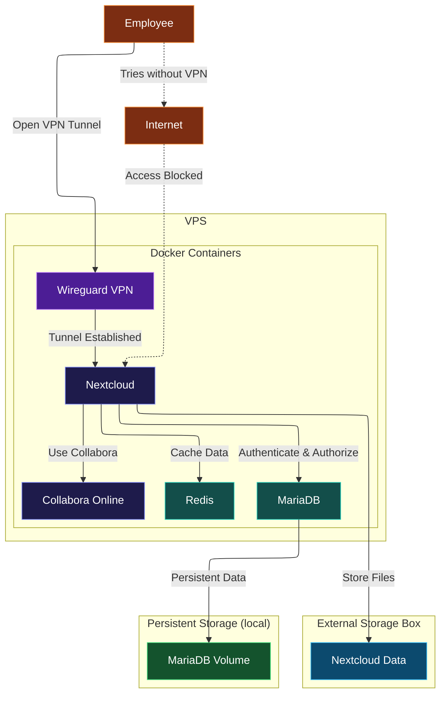

# AGRUPA-cloud
## General Overview

A private, docker-based collaboration platform for a small company. The platform is intended to keep internal services protected from direct public access by requiring users to connect through a VPN.

## Features

- Private file storage
- Secure remote access
- Online document editing
- Private DNS
- Persistent database
- Caching and file locking

## Technologies

* Docker
* Nextcloud
* MariaDB
* Redis
* Wireguard
* CoreDNS
* Collabora ONLINE

## Architecture

## Requirements

- Linux server
- Docker Engine
- Docker Compose
- Linux server
- Public IP address
- UDP port 51820 available for WireGuard
- At least 2 CPU cores
- At least 4 GB of RAM
- At least 20 GB of storage

More memory is recommended when using Collabora Online, especially when multiple documents are opened simultaneously.

## Services

## Services

| Service | Purpose | Port / Access |
|---|---|---|
| WireGuard | Provides secure remote access to the server | `51820/UDP` |
| CoreDNS | Resolves private domain names for VPN clients | VPN network only |
| Nextcloud | Provides file storage, sharing and user management | VPN network only |
| MariaDB | Stores Nextcloud application data | Docker network only |
| Redis | Provides caching and file locking | Docker network only |
| Collabora Online | Provides browser-based document editing | VPN network only |

## Security

The project uses a VPN-first access model. Users must connect through WireGuard before accessing Nextcloud or Collabora.

The main security measures include:

* Only Nextcloud can be publicly accessed through Wireguard VPN
* Internal Docker networks
* Environment variables separated
* Docker secrets for sensitive credentials
* Persistent data stored outside the containers
* Private DNS names available only to VPN clients

## Limitations of this implementations

- It requires some upfront cost
- Dependent on a cloud vps service
- Collabora Online may require additional CPU and memory resources.
- Service access depends on the WireGuard VPN being available.
- Doesnt have HTTPS inside the VPN network
- This project tries to mimic some funcionalities of Google Drive using only opensource code
